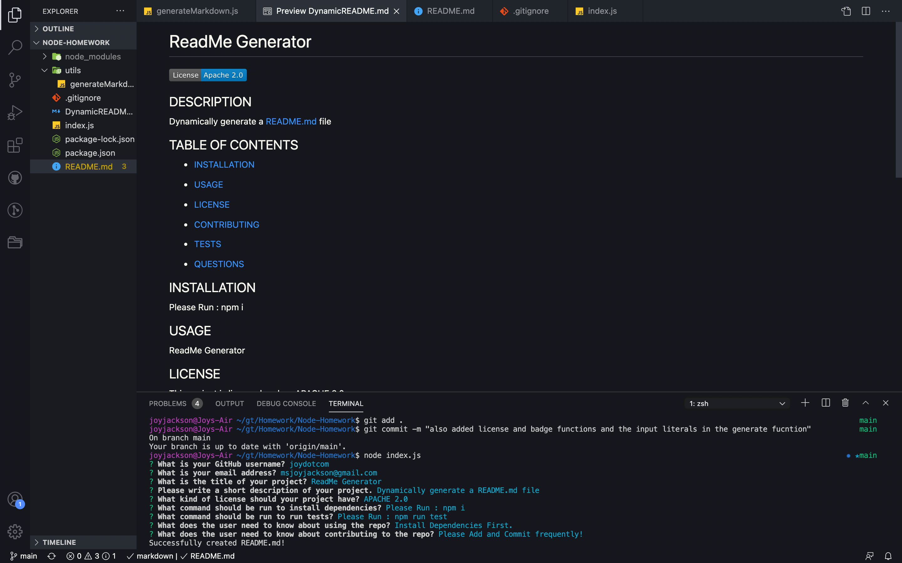

# README GENERATOR 

## DESCRIPTION

Dynamically generate a ReadMe by running node index.js and answering the prompted questions.

## DYNAMICALLY GENERATED README FILE
 [DynamicREADME.md](./DynamicREADME.md)  
 [Click here to see the dynamically generated DynamicReadme.md](https://github.com/Joydotcom/Node-Homework/blob/main/DynamicREADME.md) 

## SCREENSHOT

## DEMOLINK

[Click here to watch the demo!](https://drive.google.com/file/d/1CmAoEUtyykIm5Ljz1iDeNP0iuXSVZHcK/view)

  